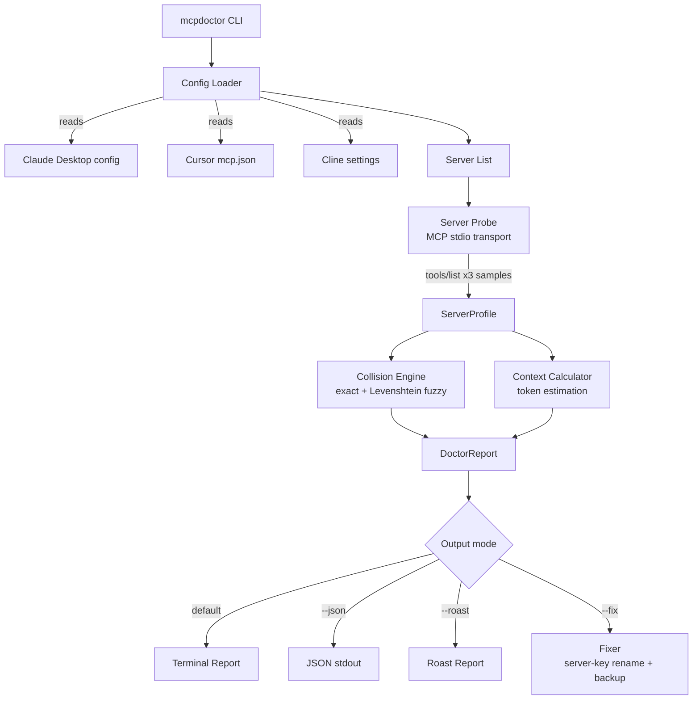

# MCPDoctor — MCP Conflict Detector

[](https://www.npmjs.com/package/mcpdoctor)
[](https://opensource.org/licenses/MIT)
[](https://nodejs.org)
[](https://www.typescriptlang.org)
[](https://github.com/pratikacharya1234/mcpdoctor)

> Detect tool name collisions, profile latency, and audit context window usage across Claude, Cursor, and Cline MCP servers.

## The Problem

Running multiple MCP servers? You have collisions. Two servers exposing `create_issue` means the AI picks the wrong one, burns tokens, and fails tasks. You don't know which server is slow. You don't know how much context your tools are eating. **MCPDoctor fixes this.**

## Architecture



## Demo

```
$ npx mcpdoctor

+----------------------------------------------------------+
|    MCPDoctor -- MCP Server Conflict Detector & Profiler  |
+----------------------------------------------------------+

CONFIGS:
  * Claude Desktop: /home/user/.config/Claude/claude_desktop_config.json

LATENCY PROFILE:
+------------+-------+------------+----------+-----------+
| Server     | Tools | Cold Start | Warm RTT | Status    |
+------------+-------+------------+----------+-----------+
| github-mcp | 12    | 45ms       | 8ms      | [OK]      |
| postgres   | 8     | 3200ms     | 420ms    | [!] slow  |
| slack-mcp  | 6     | 320ms      | 22ms     | [OK]      |
+------------+-------+------------+----------+-----------+

CONFLICTS DETECTED:
   EXACT  create_issue
    Servers: github-mcp, linear-mcp
    Fix: run --fix to rename "linear-mcp" server key, or rename tool in linear-mcp's source

CONTEXT WINDOW:
  [=========---------------------] 28%
  Tools: 47 | Tokens: 56k / 200k
  Risk: MODERATE
  Remaining: ~144k tokens (~1020 more tools at avg 141 tok/tool)

Summary: 5 servers, 47 tools, 3 healthy, 1 conflicts
```

## Install & Run

```bash
npx mcpdoctor
```

Or install globally:

```bash
npm install -g mcpdoctor
mcpdoctor
```

## Features

- **Conflict Detection** — Finds exact and fuzzy tool name collisions across servers (Levenshtein-based)
- **Latency Profiling** — Measures cold-start time and steady-state warm RTT separately per server
- **Context Window Estimation** — Calculates how much of your token budget tools consume
- **Auto-Fix Mode** — `--fix` renames conflicting server keys in config with automatic backup
- **Roast Mode** — `--roast` scores your MCP setup and surfaces real issues bluntly
- **Multi-Config Support** — Auto-detects Claude Desktop, Cursor, and Cline configs
- **CI/CD Ready** — JSON output mode (`--json`) with exit codes for pipelines

## Usage

```bash
# Auto-detect all MCP configs
npx mcpdoctor

# Specify a custom config file
npx mcpdoctor --config ./my-mcp-config.json

# JSON output for CI/CD
npx mcpdoctor --json

# Interactively fix conflicts
npx mcpdoctor --fix

# Roast your setup
npx mcpdoctor --roast

# Custom token budget
npx mcpdoctor --budget 128000
```

## Options

| Flag | Description | Default |
|------|-------------|---------|
| `-c, --config <path>` | Custom MCP config file path | Auto-detect |
| `--json` | Output as JSON | false |
| `--fix` | Rename conflicting server keys in config (with backup) | false |
| `--roast` | Score and roast your MCP setup | false |
| `--budget <tokens>` | Context window token budget | 200000 |

## Exit Codes

| Code | Meaning |
|------|---------|
| 0 | All servers healthy, no conflicts |
| 1 | Errors or conflicts detected |
| 2 | Fatal error |

## Config Detection

MCPDoctor automatically finds configs from:

- **Claude Desktop** — `~/Library/Application Support/Claude/claude_desktop_config.json` (macOS), `%APPDATA%/Claude/` (Windows), `~/.config/Claude/` (Linux)
- **Cursor** — `~/.cursor/mcp.json`
- **Cline** — VS Code global storage (`saoudrizwan.claude-dev`)

## How Conflict Detection Works

```text
Exact match:   tool_a == tool_a                   -> EXACT collision
Fuzzy match:   levenshtein(tool_a, tool_b) <= 4
               AND similarity >= 0.6              -> SIMILAR collision
```

The fuzzy pass catches near-identical names (`create_issue` / `create-issue`, `list_files` / `listfiles`) that cause the same routing ambiguity as exact matches.

## How --fix Works

`--fix` renames the *server key* in your MCP config file for the secondary server in each exact collision. This makes the host-side entry distinct without breaking the server process.

**What it changes:** the key name under `mcpServers` in the JSON config.  
**What it does not change:** the tool names the server process advertises over stdio — those must be changed in the server's source code or via a proxy wrapper.

A `.mcpdoctor-backup` file is written alongside the config before any modifications.

## Context Window Estimation

Token usage is estimated per tool as:

```text
tokens = ceil((len(name) + len(description) + len(JSON(inputSchema)) + 40) / 4)
```

The 40-byte overhead accounts for MCP framing (tool separator, JSON keys, whitespace). Risk thresholds:

| Usage   | Risk     |
| ------- | -------- |
| < 15%   | LOW      |
| 15-30%  | MODERATE |
| 30-50%  | HIGH     |
| > 50%   | CRITICAL |

## GitHub Action

Add MCP health checks to your CI:

```yaml
name: MCP Health Check
on: [push, pull_request]
jobs:
  check:
    runs-on: ubuntu-latest
    steps:
      - uses: actions/checkout@v4
      - uses: actions/setup-node@v4
        with:
          node-version: 20
      - run: npx mcpdoctor --json > mcp-report.json
      - name: Fail on collisions
        run: |
          COLLISIONS=$(jq '.collisions | length' mcp-report.json)
          [ "$COLLISIONS" -eq 0 ] || (echo "ERROR: $COLLISIONS collision(s) detected" && exit 1)
```

## Tech Stack

- TypeScript 5 + Node.js 18+
- `@modelcontextprotocol/sdk` — official MCP client over stdio transport
- `fastest-levenshtein` — O(n) Levenshtein for fuzzy matching
- Commander.js, Chalk 5, Ora 8, cli-table3, Boxen 7

## Contributing

Bug reports and pull requests are welcome. See [CONTRIBUTING.md](https://github.com/pratikacharya1234/mcpdoctor/blob/main/CONTRIBUTING.md) for guidelines.

- [Open an issue](https://github.com/pratikacharya1234/mcpdoctor/issues)
- [Start a discussion](https://github.com/pratikacharya1234/mcpdoctor/discussions)

## License

MIT — see [LICENSE](https://github.com/pratikacharya1234/mcpdoctor/blob/main/LICENSE)

Made by [pratikacharya1234](https://github.com/pratikacharya1234)
